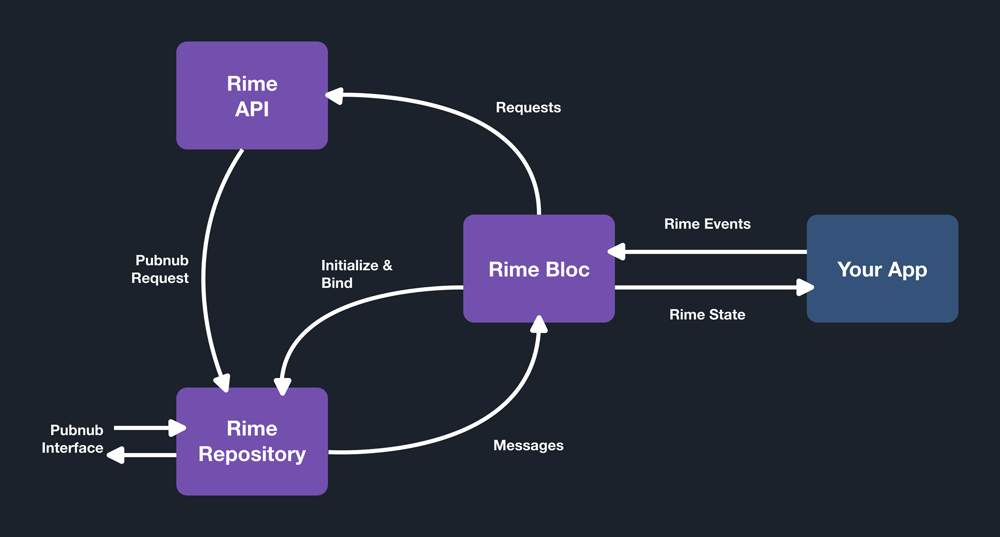

# Rime SDK

Rime is a messaging SDK that allows you to more easily integrate the PubNub real-time message system into your application.

## Overview <a name="1"></a>

The goal of this package is to make it easy to implement PubNub's rest API. 

This package helps provide state functionality for PubNub within Flutter application's. This package allows developers
to focus on design rather then Software Requirements when managing chat application's.

The plug and play nature of Rime ensures that the developer does not have to deal with the synchronization of chat data application wide. Rime also formats Pubnub data into user relavent data in the provided models.

#### Authentication and Users
:exclamation::exclamation::exclamation: **IMPORTANT** :exclamation::exclamation::exclamation:
Rime does not provide authentication functionality, that is entirely up to the developer to implement. Rime assumes that each user has a unique userID that can be provided to access a user's Rime account. 

## Jump to:

 1. [Installation](#2)
 2. [Importing](#3)
 3. [Dart Version Support](#4)
 4. [Set Up](#5)
    1. [Generate Pubnub Keyset](#5.1)
    2. [Initialize Rime](#5.2)
    3. [Verifying](#5.3)
 5. [Rime Structure](#6)
    1. [Architectural Overview](#6.2)
    2. [Rime Bloc](#6.3)
    3. [Rime Api](#6.4)
    4. [Rime Repository](#6.5)
        1. [Initialization](#6.5.1)
        2. [Channel Groups](#6.5.2)
        3. [Listening to Subscriptions](#6.5.3)
6. [Usage](#7)
    1. [Models](#7.1)
        1. [Rime Channel](#7.1.1)
        2. [Rime Message](#7.1.2)
            1. [Rime Message Encoding](#7.1.2.1)
            2. [Rime Message Decoding](#7.1.2.2)
            3. [Using Rime Message](#7.1.2.3)
    2. [Rime Api](#7.2)
    3. [Rime State](#7.3)
    4. [Rime Events](#7.4)
        1. [Initialize Event](#7.4.1)
        2. [Get Channels Event](#7.4.2)
        3. [Create Channel Event](#7.4.3)
        4. [Send Message Event](#7.4.4)
        5. [Delete Event](#7.4.5)
        6. [Leave Event](#7.4.6)
        7. [Store Event](#7.4.7)
        8. [Clear Event](#7.4.8)
    5. [Retreiving Channel History](#7.5) 
## Installation <a name="2"></a>

To add the SDK to your Dart or Flutter project, add rime as a dependency to your `pubspec.yaml`.
```yaml
dependencies:
    rime: ^0.1.0
```
After adding the dependency to `pubspec.yaml`, run `pub get` command in the root directory of your project.

## Importing <a name="3"></a>

After installing the Rime package import it in your application.
```dart
import 'package:rime/rime.dart';
```

## Dart Versions <a name="4"></a>
 - Dart 2: >= 2.7.0

## Set Up <a name="5"></a>
To sucessfuly integrate rime into your application the following steps must be completed.

### 1) Generate Pubnub Keyset <a name="5.1"></a>
Rime requires you to provision thier own Pubnub instance. The SDK adds structure to this instance through its provided functionality.

Start by logging into to the Pubnub admin console at https://www.pubnub.com and sign up to retreive a publish and subscribe keyset.

Create a `.env` file in your root directory (Same directory as `pubspec.yaml`) and copy and paste your publish and subscribe keys there
```
#Pubnub
RIME_PUB_KEY=<Pubnub Publish Key>
RIME_SUB_KEY=<Pubnub Subscribe Key>
```

Add the following line to you `pubspec.yaml` to ensure that the `.env` file is correctly imported
```yaml
flutter:
  assets:
    - .env

```
After adding the dependency to `pubspec.yaml`, run `pub get` command in the root directory of your project.

### 2) Initialize Rime <a name="5.2"></a>

Within the `main` of your application, make sure you initialize Rime by passing in the environment variables. This will extract the Pubnub publish and subscribe to store for Rime to connect to a Pubnub instance. Optionally you can pass in any custom functions you want rime to run interally by defining a `RimeDeveloperFunctions` object.
```dart
import 'package:rime/rime.dart';

import 'package:flutter_dotenv/flutter_dotenv.dart' as DotEnv;

void main(List<String> args) async {
  WidgetsFlutterBinding.ensureInitialized();

  print('Initializing');
  await DotEnv.load(fileName: '.env');
  await Rime.initialize(DotEnv.env, RimeDeveloperFunctions(
      //Optional
  ));
  print('Initialized');

  ...
  //run app
}
```

### 3) Verfying <a name="5.3"></a>
The following snippet can be run to verify whether `Rime` is initialized.
```dart
print(Rime.INITIALIZED);
```
If this statement is `true` then the rime sdk is correctly set up and can be used.

## Stucture <a name="6"></a>

### Pubnub <a name="6.1"></a>
Rime SDK heavy relies on the underlying funcationality of Pubnub to provide a serverless real-time SDK. For a complete frame of refrence on underlying Rime functionality when developing please refrence the [pubnub](https://pub.dev/packages/pubnub) Flutter client and Pubnub's [official documentation](https://www.pubnub.com/docs/).

### Architectural Overview <a name="6.2"></a>

Rime SDK is composed of 3 core elements `RimeApi`, `RimeRepository`, and `RimeBloc`. These work together to provide publish and subscribe functionality from Pubnub along with the management of Rime channel metadata.

<figure class="image">
  
  <figcaption><i>Represents the relationship between components</i></figcaption>
</figure>

### RimeBloc  <a name="6.3"></a>

`RimeBloc` is a Singleton Global State Manager for Rime, it manages application wide buinsess logic for channels; allowing components to directly subscribe to a stream of up-to-date channel data. The RimeBloc acts as the user's primary interface to communicate with Rime and the underlying Pubnub interface safely.

The `RimeBloc` object is an auto-instantiated singleton object that is generated using the the [get_it](https://pub.dev/packages/get_it) package. Use the following code to access the object from anywhere in your application.
```dart
RimeBloc();
```
On first access the object is automaically created with a non-initialized state. In this state the `RimeBloc.state` will not contain any channels. It must first be initialized by the developer using a unique userID provided on user authentication.

When initialized the user can push events to the `RimeBloc` to manipulate, create, and leave channels relative the provided UserID. 

For more information on `RimeEvents` and `RimeState` see **Usage**.

#### Implementation
The `RimeBloc` is implemented using the [flutter_bloc](https://pub.dev/packages/flutter_bloc) package. Please refrence their [online documentation](https://pub.dev/documentation/flutter_bloc/latest/) for information on how to correctly interface with RimeBloc using Bloc.

### RimeApi  <a name="6.4"></a>
The `RimeApi` is a set of functions that directly interface with the internal Pubnub client stored within `RimeRepository`.

The functions defined within the API are 1-to-1 with `RimeEvents`. This means sending out requests directly from the API successfully modify the the Pubnub instance with Rime attributes. However, this method will **prevent** any local changes `RimeState`.

For more information on `RimeApi` see **Usage**.

### RimeRepository  <a name="6.5"></a>

`RimeRepository` is a Singleton Storage Module that maintains the core Pubnub service. It is the root component of the Rime SDK and provides access to user subscription data, the client `userID`, and the live Pubnub client.

The `RimeRepository` object is an auto-instantiated singleton object that is generated using the the [get_it](https://pub.dev/packages/get_it) package. Use the following code to access the object from anywhere in your application.
```dart
RimeRepository();
```

#### Initialization  <a name="6.5.1"></a>

Initializing a RimeRepository is a crucial step before using any Rime/Pubnub related functionality. The developer is responisble for providing a `userID` into this function. it is assumed that the ID provided is an unique key associated to an authenticated user. Rime will use the `userID` to create a `UUID` for the Pubnub client. This will be used to associate channels and messages with the user.

The following code initializes the RimeRepository for a user.
```dart
await RimeRepository().initializeRime('userID');
```

---
:exclamation: **Important** :exclamation:

The `RimeRepository` must be initialized before using the `RimeApi`. This extends to any events that are dependent on `RimeLiveState`.

*The `RimeBloc` automatically initializes the `RimeRepository` when it is initialized* 

---

Upon initilization the Pubnub client and the userID can be globally accessed.
```dart
//Accessing Pubnub client
RimeRepository().client

//Accessing the authenticated userID
RimeRepository().userID

```

:-1: Avoid using the Pubnub client to directly manipulate the Pubnub instance as it may corrupt Rime encoded information.


#### Channel Groups <a name="6.5.2"></a>

Rime manages the user's subscriptions by grouping channel subscriptions for a user into Pubnub channel groups. The rationale behind this is to limit the number of subscriptions managed by the Pubnub client. Rime allocates 10 channel groups to each user, each group can maintain up to 2000 subscriptions each. 

When the `RimeRepository` is initiailized it automatically subscribes to all non-empty channel groups for a given user. The following can be used to accomplish this manually.
```dart
await RimeRepository().reset()
```

:+1: The `RimeApi` handles grouping and ungrouping channels.

For more information about Pubnub channel groups and client subscription limits please refer to the [Pubnub official documentation](https://www.pubnub.com/docs/channels/subscribe#channel-groups)

#### Listening to Subscriptions  <a name="6.5.3"></a>

The RimeRepository exposes an interface for binded components to listen to events directly from Rime channel subscriptions. 

##### Binding

Components can **bind** to the RimeRepository by providing a unique binding key and a valid call back function. The callback will fire when the client receives any messages, actions, or events sent through Pubnub to the subscribed channels.
```dart
//Define callback
RimeCallBack callBack = (Envelope en){
    ...
}

//Bind to RimeRepository
RimeRepository().addListener('unique-key', callBack)
```

:exclamation: The `RimeBloc` reserves the listener key "*rime-bloc-listener*" when it is initialized

##### Unbinding

When the event listener is not needed, components can **unbind** by inputting the unique key used to bind.
```dart
//Unbind to RimeRepository
RimeRepository().removeListener('unique-key')
```

:+1: Saving the unique key in the component to ensure binding does not loose refrence.
:+1: Unbinding when subscription is no longer needed in the component
:+1: Unbinding on `dispose()` when the component is a `StatefulWidget`.
:-1: Forgetting to close a listener

## Usage  <a name="7"></a>

### Models  <a name="7.1"></a>

Rime uses 3 models to encapsulate and format data from Pubnub: `RimeChannel`, `RimeMessage`, and `RimeChannelMemebership`.

#### RimeChannel <a name="7.1.1"></a>

A `RimeChannel` object is used to encapsulate information related to a Pubnub channel like the most recent message, user memebership metadata, members in a channel. 

:+1: The `RimeChannel` object is [Equatable](https://pub.dev/packages/equatable).

##### Properties
| Name | Type | Description
| --- | --- | --- |
| channel | `String` | The Pubnub channel ID associated to this channel. |
| groupId | `String` | The channel group this users channel memebership is within. |
| title | `String` | The display title for the message. defaulted to `null` |
| subtitle | `dynamic` | The most recent message sent in the channel in the form of `RimeMessage.enconde()` |
| lastUpdated | `int` | The `TikeToken` value for the last message sent in the channel. Used in the `Comparable` interface to compare rime channels. |
| image | `String` | The image of the channel, used to store a network url of a hosted image. defaulted to `null`  |
| isGroup | `String` | Determines if the channel is group or individual channel. Determined at creation. |
| readMap | `Map<String, int>` | A map containing channel memebers, refrenced by `userID`, mapped to the last message `Timetoken` read by the user. |
| membership | `RimeChannelMembership` | A `RimeChannelMembership` object containing the authenticated user's memebership settings. |
| uuids | `List<String>` | A list of `userID`'s associated to current memebers in the channel |

#### RimeMessage <a name="7.1.2"></a>

`RimeMessage` is an extention of Pubnub's `BaseMessage`. This model enfoces and encoding on the payload of sent `BaseMessage`'s to include the authenticalted user's `uuid` and the `type` of the message. 

##### Encoding  <a name="7.1.2.1"></a>
A `RimeMessage` is a **JSON** encoded set of properties.
| Name | Type | Description
| --- | --- | --- |
| uuid | `String` | The `userID` for the sender of the message. |
| type | `String` | The type of the message. Allows you to determine the type of strategy to choose to decode the `payload` |
| payload | `dynamic` | Developer defined payload for a message. Format should be associated to the `type` of the message |

Exsiting `RimeMessages` can be encoded using
```dart
//Encoding an exsisting RimeMessage
RimeMessage exsistingMessage;
Map<String, dynamic> encoding = exsistingMessage.encode();
```

However, if all encoding properties (`uuid`, `type`, and `payload`) are available and encoding can be generated using
```dart
//Encoding with exsisting properties
String uuid;
String type;
dynamic contentPayload
Map<String, dynamic> encoding = RimeMessage.toRimeMesageEncoding( uuid, type, contentPayload);
```

##### Decoding  <a name="7.1.2.2"></a>
A `BaseMessage` that is retrieved from Pubnub that contains an rimes a `RimeMessage` encoding within it's `content` has suffient information to be decoded into a `RimeMessage` object. Decoding removes the JSON nesting around the `BaseMessage.content`, extracting the `type`, `uuid`, and ensuring the `content` within the created message is the developer encoded message payload.
```dart
//Decoding from an exsisiting BaseMessage from Pubnub
BaseMessage receivedMessage;
RimeMessage rimeMessage = RimeMessage.fromBaseMessage(receivedMessage);

print(receivedMessage.content['payload'] == rimeMessage.content);
// True
```

##### Properties 
| Name | Type | Description
| --- | --- | --- |
| uuid | `String` | The `userID` for the sender of the message. |
| type | `String` | The type of the message. Allows you to determine the type of strategy to choose to decode the `content` |
| content | `dynamic` | Developer defined payload for a message. Format should be associated to the `type` of the message. Extracted from `payload` defined in the message encoding |
| publishedAt | `Timetoken` | A Pubnub `TimeToken` associated to the time when this message was published |
| originalMessage | `dynamic` | The orignal message encoded within the `BaseMessage` retreived from Pubnub |

##### Intented Usage  <a name="7.1.2.3"></a>
The model is intented to be **extended** into various message types by the developer to differentiate between parsing strategies. Rime will provide JSON encoded `RimeMessage`'s (or complete `RimeMessage`'s when possible*) for you to parse and populate your UI with.

The provided `TextMessage` is a simple example of creating a typed extension to `RimeMessage`. It contains a `text` custom property to map to its payload, which is JSON encoded.
```dart
/// Message only containing text
class TextMessage extends RimeMessage {
  ///The type of the message when it is a rime message
  static const String RIME_MESSAGE_TYPE = 'text-message';

  /// Content
  String text;

  ///Constructor to create a text message
  TextMessage._({@required this.text, @required RimeMessage message})
      : assert(message != null),
        assert(message.type == RIME_MESSAGE_TYPE),
        super(
            uuid: message.uuid,
            type: message.type,
            content: message.content,
            publishedAt: message.publishedAt,
            originalMessage: message.originalMessage);

  /// Parsing constructor,
  /// Converts the RimeMessage object into a textmessage object by parsing its content
  factory TextMessage.fromRimeMessage(RimeMessage message) {
    //Extract text object from content
    String text = message.content['text'];

    return TextMessage._(text: text, message: message);
  }

  /// Creates a Rime Message payload from defined inputs
  static Map<String, dynamic> toPayload(String text) {
    return {'text': text};
  }
}
```

In this example a simple switch statement can be employed to decode a `RimeMessage` into a `TextMessage`
```dart
// Fulled populated BaseMessage object retreived from Pubnub
RimeMessage encodeByType(BaseMessage receivedMessage){
    // Decoded into a RimeMessage
    RimeMessage rimeMessage = RimeMessage.fromBaseMessage(receivedMessage);

    // Decodes RimeMessage absed on type
    switch (rimeMessage.type) {

        //Parse text message
        case TextMessage.RIME_MESSAGE_TYPE:
            return TextMessage.fromRimeMessage(rimeMessage);    

        // Other case statements associated to various types and parsers
        ...

        default:
            throw('No type decoder found')
    }
}
```

### RimeApi  <a name="7.2"></a>

The `RimeApi` contains a set of requests to manipluate and format the Pubnub storage instance.

:exclamation: The `RimeRepository` must be **initialized** before `RimeApi` functions can be used.

#### Requests
The following is a specification of all `RimeApi` requests.
| Request name | Input(s) | Output | Description | Assertions |
| --- | --- | --- | --- | --- |
| createChannel | `List<String> users` | `RimeChannel` | Creates a new RimeChannel between the inputted `userIDs`. Creates a memebership for each of the users and adds the channel to each user's next available Channel Groups.<br/><br/>Outputs a fully populated `RimeChannel` | The authenticated user's `userID` must be within the list of userIDs. |
| getChannel | `String channelID` | `RimeChannel` | Retreives a fully populated channel by the inputted `channelID` | The authenticated user must be a memeber of the channel. |
| deleteChannel | `String channelID` | `bool` | Updates the user's channel memebership settings to indicate that the user has deleted messages within a channel for themselves. This is represented as the `Timetoken` value of the last sent message.<br/><br/>The value indicates to the UI that messages past the defined `Timetoken` should be ignored.<br/><br/>Outputs the sucess of the request. | The authenticated user must be a memeber of the channel. |
| leaveChannel | `String userID`<br/>`String channelID` | `void` | Destroys a user's memebership to a channel and removes the channel from its channel group.<br/><br/>This request is not necissarily targetted at the authenticated user. it can be used to kick a user out of a channel aswell. | The input user but be a memeber within the channel |
| sendMessage | `String channelID`<br/>`Map<String, dynamic> message` | `Tuple2<ChannelMetaDetails, RimeMessage>` | Sends the JSON payload in the `message` input to the channel defined by `channelID`.<br/><br/>Returns sent message along with any channel update results from Pubnub | The user within the message payload must be a member of the channel.<br/><br/>The message JSON must be an encoded `RimeMessage`|
| getMostRecentChannels | (optional) `int limit`<br/>(optional) `String start` | `Tuple2<List<RimeChannel>, String>` | Paginated get channels reqeust for authenticated user. Retreived the list of channels ordered by `lastUpdated`.<br/><br/>Channels are retreived relative to a `start` cursor. If no `start==null` then the start of the channels list is returned.<br/><br/>The amount of channels requested is defined by the `limit` input, defaulted to `50`.<br/><br/>Along with the list of channels, the next cursor is outputted. | Always retrieves requests for authenticated user |
| getChannelMemebers | `String channelID` | `List<ChannelMemberMetadata>` | Retreives the Pubnub memebership metadata for memebers within a channel | Channel must exsist |
| getGroupIDFromChannelID | `String userID`<br/>`String channelID` | `String` | Returns the Channel Group ID hosting the channel the user is a memeber of | Channel must exsist.<br/><br/>User must exsisit.<br/><br/>User must be a memeber of the channel |


:exclamation: Ensure that the assertions for each requests are met so that they may operate properly.

:+1: All requests are `async`

:+1: Example request to create channel:
```dart
RimeChannel newChannel = await RimeApi.createChannel(['userID1', 'userID2']);
```


### RimeState <a name="7.3"></a>

`RimeState` is the type of state that the `RimeBloc` holds. It is manipulated through `RimeEvents` sent the Bloc.

Refer to the [bloc](https://pub.dev/packages/bloc) and [flutter_bloc](https://pub.dev/packages/flutter_bloc) package documentations for insight on the relationships between States and Blocs with `BlocBuilder` and `BlocListener`.

#### RimeEmptyState
Innitial state for the `RimeBloc` does not store any values. while on this state, `RimeBloc` limits the `RimeEvents` that can be triggered to:
 - `InitiailizeRime`
 - `ClearRime`

#### RimeLiveState
The `RimeLiveState` is entered when the `InitializeRime` event is triggered in the `RimeBloc`. The state acts as a cache for channels, allowing you subscribe to ever updating `RimeChannel` information application wide.

:+1: Along with maintiaing a channel cache, the state also maintiains the **time ordering** of channels.
:+1: While on `RimeLiveState` you are able to send all `RimeEvents` to `RimeBloc`

##### Properties
The following properties are cahced within the most relavent `RimeLiveState` for the `RimeBloc`
| Name | Type | Description
| --- | --- | --- |
| timeToken | `int` | The `Timetoken` value associated to the last update of the `RimeLiveState` |
| pageToken | `String` | The page index for the last `GetChannels` event |
| orgainizedChannels | `List<String>` | A time decending ordered list of `channelIDs` stored within the current state |
| storedChannels | `Map<String, RimeChannel>` | The cache of channels mapped to `channelID` allowing of `O(1)` retreival of a `RimeChannel` by ID |


These properties are aviable to the developer when subscribing to `RimeBloc` or accessing `RimeBloc().state`.

:exclamation: `RimeBloc().state` statically retreives the state and will not record future state changes past the retreival.

##### Retrieve Channels

Retrieve a list of chronologically ordered channels based off the last message sent from PubNub.
```dart
RimeLiveState liveState = state as RimeLiveState;

List<RimeChannel> channels = liveState.orgainizedChannels.map<RimeChannel>((channel){
    return liveState.storedChannels[channel];
}).toList();
```

### RimeEvent <a name="7.4"></a>

Each `RimeEvent` maps to unique logic within the `RimeBloc` and are added to the Bloc to manipulate the `RimeState`. Events are resposible for safely calling `RimeApi` and `RimeRepository` requests by ensuring input parameters and updating the state relative to the results. You will be resposible for invoking specific `RimeEvents` during the lifecycle of your application.

Refer to the [bloc](https://pub.dev/packages/bloc) package documentation for insight on the relationships between Events and Blocs.

#### Initialize Event <a name="7.4.1"></a>
Initiailizes the `RimeBloc` by initiailizing `RimeRepository` on the defined `userID`. The event subscribes `RimeBloc` to `RimeRepository` to manage manipulations to channels based on incoming messages. The `RimeBloc` then moves to `RimeLiveState` and invokes a `GetChannels` Event to retreive the innitial set of channels.
```dart
//Example
RimeBloc().add(InitializeRime('userID'));
```

:+1: `InitializeRime` is the only way to move from `RimeEmptyState` to a fresh `RimeLiveState`

#### Get Channels Event <a name="7.4.2"></a>
Calls the `RimeApi.getMostRecentChannels` request passing the `start` index as the previously stored `pageIndex` within the current `RimeLiveState`. Adds and sorts new Channels to the `RimeLiveState`.
```dart
//Example
RimeBloc().add(GetChannelsEvent());
```

:exclamation: Can only be called when `RimeBloc().state` is `RimeLiveState`

:+1: `GetChannels` is called for the first time automatically in the `InitializeRime` event.

#### Create Channel Event <a name="7.4.3"></a>
Calls the `RimeApi.createChannel` request passing in the `users` directly to the request. Adds and sorts the new channel to the `RimeLiveState`. an `onSuccess` callback returns the newly created channel.
```dart

//Example
RimeBloc().add(CreateChannelEvent(users: ['user1', 'user2'], onSuccess: (channel){}));
```

:exclamation: Can only be called when `RimeBloc().state` is `RimeLiveState`

#### Send Message Event <a name="7.4.4"></a>
Calls the `RimeApi.sendMessage` request by encoding the `payload` and `type` into a RimeMessage JSON encoding along with the authenticated user. The returned `RimeMessage` is used to update a cached `RimeChannel` within the current `RimeLiveState` with the message properties.
```dart
//Example
RimeBloc().add(MessageEvent('ChannelID', TextMessage.RIME_MESSAGE_TYPE, TextMessage.toPayload('Hello world')));
```

:exclamation: Can only be called when `RimeBloc().state` is `RimeLiveState`

#### Delete Event <a name="7.4.5"></a>
Calls the `RimeApi.deleteChannel` to update the authenticated user's channel memebership settings to reflect the message being deleted at the last message `Timetoken`. This updates a cached `RimeChannel` within the current `RimeLiveState` with the updated memeebrship properties.
```dart
//Example
RimeBloc().add(DeleteEvent('ChannelID'));
```

:exclamation: Can only be called when `RimeBloc().state` is `RimeLiveState`

#### Leave Event <a name="7.4.6"></a>
Calls the `RimeApi.leaveChannel` to remeove a channel memebership for the authenticated user. The channel is removed from the current `RimeLiveState`
Leave a channel corresponds to a userID and will delete the channel from the state. Will only delete for the corresponding userID which intialized Rime.
```dart
//Example
RimeBloc().add(LeaveEvent('ChannelID'));
```

:exclamation: Can only be called when `RimeBloc().state` is `RimeLiveState`

#### Store Event <a name="7.4.7"></a>
Takes a `RimeChannel` object and stores the into the current `RimeLiveState`. Upon storage the channels within the state are sorted.
```dart
//Example
RimeBloc().add(StoreEvent(exsistingChannel));
```

:exclamation: Can only be called when `RimeBloc().state` is `RimeLiveState`

:exclamation: Any exsisting channels mapped to the channelID of the new channel are **overriden**, so be careful with this event

:exclamation: The `RimeChannel` must have a **non-null** `lastUpdated` token and `channelID` to be stored

#### Clear Event <a name="7.4.8"></a>
Clears a `RimeBloc` by moving it to `RimeEmptyState`. This removes all caching within `RimeLiveState`.
```dart
//Example
RimeBloc().add(ClearRimeEvent());
```

### Retreiving Channel History <a name="7.5"></a>

Rime exposes the `ChannelStateProvider` which is a state provider for listening to the channel history and retreiveing associated relatvent `RimeChannel`. The provider accomplishes this through a subscription to `RimeRepository` (for new messages) and `RimeBloc` (for channel updates).

The `builder` and `listner` function within the consturctor are used to provide the associated channel history and `RimeChannel` to any components using it.
```dart
//Example
ChannelStateProvider(
    channelID: 'ChannelID',
    controller: _controller, //ChannelProviderController
    loadSize: 30 //Amount of messages per load
    builder: (context, channel, messages){
        //Build UI based on channel and messages
        ...
    }
    listener: (context, channel, messages){
       //Repsond to state changes
       ...
    }
)
```

:+1: the `ChannelStateProvider` automatically converts the `BaseMessages` into `RimeMessages`

:+1: when using `ChannelStateProvider` expect the most up to date information about a channel

:exclamation: The channel must be a valid user channel

#### Loading more messages <a name="7.5.1"></a>
The `ChannelProviderController` can be defined and binded to the `ChannelStateProvider` to controll the **loading** and **resetting** of state channel history.

Define a controller and bind it to `ChannelStateProvider`:
```dart
ChannelProviderController controller = ChannelProviderController();
ChannelStateProvider(
    controller: _controller, //ChannelProviderController binded
    ...
)
```

Loading more messages can be done with a **binded** controller. The request is `async` and returns `bool` representing if there is more messages in the channnel history:
```dart
//Example on binded controller
bool hasMore = await controller.loadMore();
```

Resetting the messages within the history state to the innitial load can be done with a **binded** controller. The request is `async` and returns `bool` representing if there is more messages in the channnel history:
```dart
//Example on binded controller
bool hasMore = await controller.reset();
```

:+1: When you're done with the controller be sure to dispose it to unbind the dirty `ChannelStateProviderState`:
```dart
//Example on binded controller
controller.dispose();
```